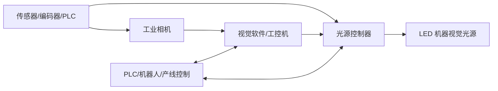
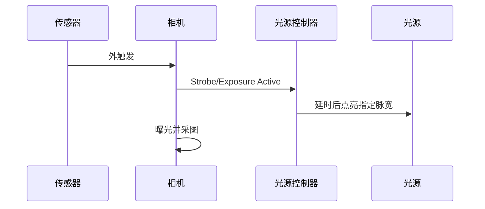
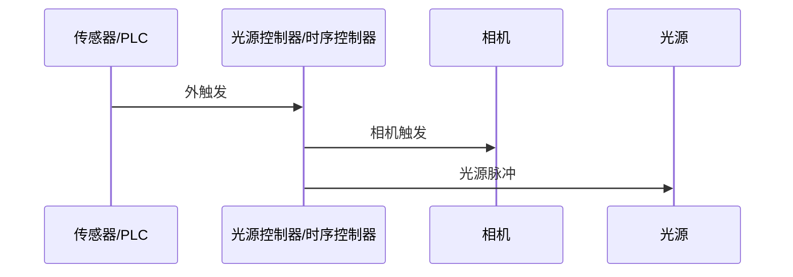

# 机器视觉光源控制器详解

> 面向机器视觉、工业检测、自动化集成、设备调试人员的系统性梳理。本文重点讨论 LED 机器视觉光源控制器，包括连续光控制、频闪控制、过驱控制、多通道同步、通信接口、选型与调试。
@[toc]
## 前言

在机器视觉系统里，相机决定“如何采图”，镜头决定“看多大、看多清楚”，光源决定“缺陷或特征有没有对比度”，而光源控制器决定“光源何时亮、多亮、亮多久、由谁触发、是否安全”。它本身不发光，却是照明稳定性、频闪同步、LED 寿命和设备可维护性的关键执行单元。

光源控制器的核心任务可以概括为三类：

| 核心任务 | 具体含义 | 对图像的影响 |
|---|---|---|
| 稳定供电 | 为 LED 光源提供稳定、低纹波、受控的电流或电压 | 减少图像灰度漂移，提高算法稳定性 |
| 亮度调节 | 通过恒流调节、PWM 调光或数字设定调整输出 | 适配不同产品、材料、曝光和光圈 |
| 时序控制 | 在常亮、频闪、外触发、过驱等模式间切换 | 冻结运动、抑制环境光、同步相机曝光 |

如果只记一句话：光源控制器不是普通电源，而是机器视觉照明的“亮度 + 时序 + 通信 + 保护”控制中心。

## 一、光源控制器在视觉系统中的位置

机器视觉系统通常由相机、镜头、光源、光源控制器、触发传感器、运动机构、工控机或 PLC、视觉软件组成。光源控制器连接在“控制系统”和“LED 光源”之间，负责把供电、触发、亮度、时序、保护、通信等功能统一起来。

典型链路如下：



在一个稳定的视觉项目中，光源控制器的价值不只是“把灯点亮”，而是让每一张图像的照明条件可重复、可追溯、可同步、可保护。对于高速运动、强反光、暗色材料、小缺陷、线扫、大视野、多工位等场景，控制器往往直接决定图像质量上限。

## 二、为什么不能只用普通电源给光源供电

LED 是电流驱动器件。很多机器视觉 LED 光源虽然标称 12 V、24 V 或 48 V，但最终影响亮度、寿命、热稳定性和一致性的核心变量仍然是 LED 结电流、脉冲宽度、占空比和散热条件。普通开关电源只负责输出电压，不一定能精确限制 LED 电流，也不一定能处理微秒级触发、频闪、过驱、通道同步、短路保护和远程参数管理。

专用光源控制器通常提供以下能力：

- 稳定的恒流或受控恒压输出，减少亮度漂移。
- 连续光和频闪模式切换。
- 与相机曝光、外部触发、运动位置同步。
- 在短时间内安全过驱 LED，提高瞬时亮度。
- 多通道独立亮度、延时、脉宽和触发逻辑。
- 过流、过压、短路、过温、占空比限制等保护。
- 通过以太网、RS-232、RS-485、EtherNet/IP、PROFINET、模拟量、数字 IO 等接口接入设备系统。
- 保存配方，适配多品种、多工位和自动换型。

## 三、核心概念

### 3.1 光源控制器、驱动器、电源的区别

| 名称 | 主要职责 | 常见能力 | 在视觉项目中的角色 |
|---|---|---|---|
| 普通电源 | 提供 DC 电压 | 24 V、48 V 输出，功率余量 | 只能供电，通常不能精确控光 |
| LED 驱动器 | 驱动 LED 发光 | 恒流、限流、PWM 调光 | 保证 LED 以合适电流工作 |
| 光源控制器 | 驱动 + 时序 + 通信 + 保护 | 亮度、频闪、触发、延时、多通道、配方 | 机器视觉照明的系统级控制节点 |
| 集成式光源 | 光源内置驱动或控制模块 | 直接接相机、PLC 或电源 | 接线简单，灵活性取决于内置功能 |

很多厂家会把“controller”“driver”“control unit”“strobe controller”等词混用。实际选型时不要只看名称，要看输出方式、最大电流、触发精度、脉宽范围、占空比限制、通信协议和保护策略。

### 3.2 恒流与恒压

恒流控制是机器视觉 LED 控制中更常见也更稳妥的方式。因为 LED 的伏安曲线非线性，同样的电压变化可能导致电流大幅变化，温度升高后正向压降也会变化，若没有可靠限流，亮度和寿命都会受影响。

图：顺尚信模拟恒流控制器产品示例，恒流输出更适合对灰度一致性和光源稳定性有要求的检测场景。

恒压控制常见于一些内置限流电阻或内置驱动的 24 V 光源，接线简单，但在高精度、强过驱、高速频闪、多通道一致性要求高的场景，恒流控制更容易获得稳定和可重复的照明。

### 3.3 连续光、频闪、脉冲

连续光模式下，光源在检测期间一直亮。优点是调试直观，系统简单，相机取像不需要严格配合闪光。缺点是发热更高、寿命压力更大、对运动模糊帮助有限，且在高亮需求下功耗和散热会很快变得困难。

频闪或脉冲模式下，光源只在相机曝光或目标到达特定位置时点亮。优点是瞬时亮度高、平均发热低、可冻结运动、可降低环境光影响。缺点是需要处理触发时序、延时、脉宽、相机曝光和占空比限制。

### 3.4 过驱

过驱是指在很短时间内用高于连续额定电流的电流驱动 LED，以换取更高的瞬时亮度。过驱的基本前提是脉冲足够短、占空比足够低、散热条件可控，并且控制器能限制最大脉宽、频率和平均功耗。

典型关系：

```text
占空比 Duty Cycle = 脉冲宽度 Pulse Width × 频率 Frequency
平均电流 I_avg ≈ 峰值电流 I_peak × 占空比
过驱倍数 Overdrive Factor = I_peak / I_continuous_rating
```

注意：这些公式只能做初步估算。LED 热行为还与封装、基板、散热器、环境温度、光源结构、波长和控制器保护算法有关，最终必须以厂家给定的脉冲曲线、占空比限制和实际温升测试为准。

### 3.5 延时、脉宽、曝光和运动冻结

视觉频闪的目标不是“灯闪一下”，而是让有效光能覆盖相机真正积分的时间窗口。

关键变量：

- 触发延时：从外部触发到光源点亮的时间。
- 脉冲宽度：光源点亮持续时间。
- 相机曝光时间：传感器积分时间。
- 相机触发延时：从触发到曝光开始的时间。
- LED 上升沿和下降沿：光强从 0 到稳定值、从稳定值到关闭所需时间。
- 控制器响应时间和抖动：每次触发时序的重复性误差。

运动模糊近似关系：

```text
模糊距离 = 物体速度 × 有效曝光时间
```

如果目标速度为 1 m/s，希望模糊小于 0.05 mm，则有效闪光时间最好小于：

```text
0.05 mm / 1000 mm/s = 0.00005 s = 50 µs
```

这就是高速检测中频闪和过驱特别重要的原因：相机曝光可以设置得相对长一点以便触发稳定，但真正决定运动冻结效果的可能是闪光脉宽。

## 四、光源控制器的主要类型

实际选型中，同一台控制器可以同时落入多个分类。例如一台 4 通道控制器可能既是恒流型，又支持 PWM 调光、外触发频闪、RS-232 通信和 DIN 导轨安装。因此分类的目的不是给产品贴唯一标签，而是帮助工程师快速看懂规格书。

### 分类总览

| 分类维度 | 常见类型 | 重点关注 |
|---|---|---|
| 按驱动方式 | 恒压、恒流、恒流 + PWM、恒流脉冲 | 是否匹配光源电气结构，灰度是否稳定 |
| 按工作模式 | 常亮、频闪、外触发、过驱 | 是否满足速度、曝光、寿命和散热要求 |
| 按通道数 | 1/2/4/8/12/16 通道，分时控制 | 每路是否独立亮度、触发、延时、脉宽 |
| 按通信方式 | 面板、IO、RS-232、RS-485、Ethernet、Modbus、工业总线 | 是否能接入上位机、PLC 或视觉软件 |
| 按安装形态 | 桌面式、面板式、DIN/C45 导轨式、内置式 | 是否适合控制柜、设备空间和维护方式 |
| 按应用对象 | 面阵、线扫、高功率、UV/IR、相机直连 | 是否满足专用光源的功率和时序要求 |

### 4.1 模拟调光控制器

模拟调光通常通过电位器、0-5 V、0-10 V、4-20 mA 或类似模拟输入控制亮度。优点是简单、成本低、易与 PLC 模拟量模块配合。缺点是抗干扰、重复性、参数可追溯性和远程管理能力较弱。

图：顺尚信模拟控制器产品示例，常见于基础亮度调节和简单多通道光源驱动场景。

适用场景：

- 低速检测。
- 单一产品、少换型。
- 对亮度重复性要求中等。
- 不需要复杂触发时序。

### 4.2 数字调光控制器

数字控制器通过按键、旋钮、串口、以太网或工业总线设置亮度，常见设置范围如 0-255、0-999、0-4095 或百分比。优点是参数可保存、可读取、可配方化，适合自动化设备。

图：顺尚信数显控制器产品示例，前面板显示和按键更便于现场调试与通道设置。

很多国产控制器会在前面板提供 `SEL`、`+`、`-`、通道指示和数码管显示，用于设置当前通道亮度。它适合调试和小型设备，但在量产设备中，建议用软件或 PLC 下发参数，并在开机时读取校验，避免现场误改。

适用场景：

- 多品种配方切换。
- 多工位多光源。
- 需要把光源参数纳入设备软件。
- 需要远程诊断和维护。

### 4.3 频闪控制器

频闪控制器以触发信号为核心，重点控制点亮时刻、延时、脉宽和峰值电流。它可以由相机、PLC、传感器、编码器或视觉软件触发。

常见功能：

- 外部触发输入。
- 可设定延时和脉宽。
- 上升沿、下降沿或电平触发。
- 触发倍频、分频、滤波。
- 多通道同步或错峰点亮。
- 相机曝光输出或 strobe 输出兼容。

### 4.4 过驱频闪控制器

过驱频闪控制器允许短时间输出远高于连续额定电流的脉冲电流，并内置保护逻辑。它适合高速产线、小曝光时间、大景深小光圈、偏振片损光、窄带滤光片损光、UV/IR 低响应、暗色材料等“光不够”的场景。

图：顺尚信频闪控制器产品示例，适合短脉冲、高速触发和相机曝光同步类应用。

选型时必须确认：

- 光源是否允许过驱。
- 最大峰值电流。
- 最小和最大脉宽。
- 最大频率。
- 最大占空比。
- 控制器是否按通道限制平均功率。
- 光源线缆长度是否会影响脉冲边沿。
- 过驱是否会改变颜色、波长、光强一致性或寿命。

### 4.5 多通道控制器

多通道控制器可以同时管理多个光源，例如环光、同轴光、背光、条光、穹顶光、线光源等。每个通道可以有独立亮度、延时、脉宽和触发源。

典型用途：

- 同一相机多种照明组合，拍多张图做融合或缺陷分类。
- 多相机共用一个控制器。
- 一台设备多个检测工位统一管理。
- 用不同波长或不同角度增强不同缺陷。

### 4.6 线扫专用或高功率控制器

线扫应用常常需要极高亮度、长时间稳定、与编码器同步或按行频控制。与面阵相机不同，线扫系统可能长期高占空比运行，因此并不总是适合强过驱。线扫更关心长期热稳定、光强均匀性、纹波、响应速度和行同步。

图：顺尚信大功率模拟控制器产品示例，适合高功率光源、较大视野或需要更高输出余量的场景。

部分分时或线扫控制器支持一次外部触发后按预设顺序依次点亮多个通道，例如 4 路或 8 路光源依次输出，用于多角度缺陷增强、同一物体多张图像采集、线扫分区域照明等。此类控制器要特别关注通道切换速度、触发延迟一致性和总功率分配。

### 4.7 相机直连与内置驱动光源

一些智能光源或内置驱动光源可以直接接相机 strobe 输出或 PLC 数字输出，不需要外置控制器。优点是系统简洁、接线少、成本低。缺点是可扩展性、复杂时序、多通道同步、过驱能力和远程诊断能力可能受限。

## 五、关键技术指标

### 参数速查表

| 参数 | 说明 | 选型时怎么用 |
|---|---|---|
| 通道数 | 可独立控制的输出回路数量，常见 1/2/4/8/12/16 路 | 对应实际光源数量、工位数量和是否分时点亮 |
| 输出电压 | 控制器输出或适配光源输入电压，如 12 V、24 V、48 V | 必须与光源输入规格一致 |
| 连续输出电流 | 常亮模式下每通道可长期输出的电流 | 决定是否能稳定驱动光源 |
| 脉冲峰值电流 | 频闪或过驱时允许的瞬时电流 | 决定短曝光时能否获得足够亮度 |
| 总功率 | 多通道合计输出能力 | 多路同时点亮时尤其重要 |
| 亮度调节级数 | 0-255、0-999、0-4095 等 | 影响调光精细度和配方可重复性 |
| 恒流精度 | 输出电流相对设定值的误差 | 高精度测量和灰度判级越高越重要 |
| 纹波 | 输出电流或电压的波动 | 纹波过大会造成灰度不稳定 |
| 触发延迟 | 接收触发到实际输出的时间 | 高速产线和高放大倍率检测要重点核实 |
| 延时分辨率 | 可设置延时的最小步进 | 决定能否精细对齐曝光窗口 |
| 最大脉宽 | 频闪/过驱允许的最长点亮时间 | 超限可能损伤 LED 或触发保护 |
| 最小脉宽 | 控制器能稳定输出的最短脉冲 | 超短曝光、冻结运动时关键 |
| 最大频率 | 每秒可触发次数 | 必须高于产线最高拍照频率 |
| 占空比限制 | 点亮时间占周期比例上限 | 关系到平均功耗、温升和寿命 |
| 触发输入电平 | TTL、5 V、12 V、24 V、NPN/PNP 等 | 需匹配相机、PLC、传感器输出 |
| 输入隔离 | 光耦隔离、差分输入等 | 工业现场抗干扰和保护能力 |
| 通信接口 | RS-232、RS-485、Ethernet、Modbus、工业总线等 | 决定二次开发和设备集成难度 |
| 安装方式 | 螺丝固定、面板安装、DIN/C45 导轨等 | 影响控制柜布局和维护 |
| 防护与散热 | 外壳、防护等级、风冷/自然冷却 | 决定现场可靠性 |

### 5.1 输出电压、电流与功率

选型时要匹配光源输入规格。常见视觉光源为 12 V、24 V、48 V，也有高功率线光源或频闪光源需要更高电压或专用恒流输出。

需要核对：

- 单通道最大连续电流。
- 单通道最大脉冲电流。
- 总功率限制。
- 多通道同时点亮时是否降额。
- 输出类型是恒流、恒压还是 PWM。
- 光源是否内置驱动，是否能接外部恒流控制器。

### 5.2 调光分辨率与线性

调光分辨率决定亮度设置精细程度，但不等于实际光强线性。LED 光强、电流、温度和相机灰度之间都可能存在非线性。

高精度测量场景建议：

- 用标准白板或稳定样件标定灰度。
- 记录控制器设定值、相机曝光、增益、光圈。
- 避免在 LED 极低亮度段使用，因为低段可能受 PWM 量化、噪声、非线性影响更明显。
- 优先使用恒流调光而不是简单电压调光。

### 5.3 触发输入

常见输入类型：

- NPN/PNP 光电传感器。
- TTL/CMOS 信号。
- 差分信号。
- PLC 24 V 输入输出。
- 相机 strobe 输出。
- 编码器 A/B/Z 相。

需要关注：

- 输入电压范围。
- 上升沿/下降沿触发。
- 输入隔离。
- 最小触发脉宽。
- 最高触发频率。
- 输入滤波时间。
- 是否支持反相逻辑。

多数工业现场会遇到 5-24 V 宽电压触发、NPN/PNP 输出、相机 TTL 输出和 PLC 晶体管输出混用的情况。控制器如果支持高低电平双向触发、输入光耦隔离和触发滤波，现场兼容性会好很多。若触发线较长或现场变频器、电机较多，应优先考虑隔离输入、屏蔽线、差分信号或就近中继。

### 5.4 触发输出

有些控制器不仅接收触发，还能输出触发给相机、PLC 或其他控制器，用于建立“控制器作为时序中心”的架构。

常见用途：

- 外部传感器先触发控制器，再由控制器按延时触发相机和光源。
- 多光源分时点亮，控制器输出不同相机触发。
- 编码器输入后生成线扫同步或位置窗口。

### 5.5 延时、脉宽和抖动

需要看三个层次：

- 可设范围：例如 1 µs 到数秒。
- 设置分辨率：例如 1 µs、10 µs、100 µs。
- 重复精度或抖动：每次触发实际输出相对于设定值的波动。

高速运动和高放大倍率场景对抖动更敏感。例如目标速度很快时，10 µs 抖动就可能造成明显位置偏差。

### 5.6 最小脉宽与上升时间

控制器可以设置 1 µs 脉宽，不代表光源实际能在 1 µs 内达到稳定亮度。LED 芯片本身很快，但光源内部电路、电缆电感、电容、控制器输出级都会影响边沿。

在超短脉冲应用中，要确认：

- 实际光脉冲波形。
- 有效光能是否足够。
- 相机曝光窗口是否覆盖光脉冲。
- 相机全局快门或卷帘快门是否匹配。

### 5.7 过驱限制

过驱控制器的指标不能只看“最大电流”。还要结合脉宽、频率和占空比。

示例：

```text
光源连续额定电流：1 A
计划过驱峰值电流：5 A
脉宽：100 µs
频率：100 Hz
占空比：100 µs × 100 Hz = 1%
平均电流约：5 A × 1% = 0.05 A
```

平均电流看起来很低，但峰值电流、LED 结温瞬态、控制器输出能力、线缆压降都仍然必须满足要求。

### 5.8 通信接口

常见接口：

- RS-232：简单、成本低、点对点。
- RS-485：适合较长距离和多设备总线。
- Ethernet/TCP/IP：适合上位机软件和多控制器网络。
- EtherNet/IP、PROFINET、EtherCAT：适合 PLC 和工业自动化集成。
- USB：适合调试和实验室。
- IO-Link：适合小型智能设备接入。
- 模拟量和数字 IO：适合传统 PLC 控制。

自动化设备中，建议尽量让光源亮度、模式、脉宽、延时和报警状态能被上位机或 PLC 读取。否则设备量产后很难判断“图像变差”是光源衰减、参数误改、相机漂移还是工件变化。

### 5.9 保护与诊断

优秀控制器通常具备：

- 过流保护。
- 短路保护。
- 过压保护。
- 过温保护。
- 断线检测。
- 光源识别或功率限制。
- 占空比和脉宽限制。
- 触发频率超限报警。
- 参数锁定。
- 故障码和日志。

这些功能在设备量产和现场维护中非常重要。没有诊断能力的系统，一旦图像异常，工程师只能靠排查线缆、换灯、换相机来试错。

## 六、控制方式与电路原理

### 6.1 PWM 调光

PWM 通过快速开关 LED，占空比越大，平均亮度越高。

优点：

- 效率高。
- 发热可控。
- 数字实现简单。
- 亮度重复性较好。

风险：

- PWM 频率过低时可能与相机曝光产生条纹或亮度波动。
- 卷帘快门相机更容易受 PWM 影响。
- 高速运动或短曝光下，PWM 周期必须远短于曝光时间，或者使用恒流模拟调光/同步频闪。

### 6.2 模拟恒流调光

模拟恒流通过改变 LED 电流幅值调节亮度。它没有 PWM 开关纹波，适合对曝光稳定性敏感的场景。

风险：

- 低电流段颜色、效率和线性可能变化。
- 电路成本和热设计要求更高。

### 6.3 恒压 PWM 控制

对于内置限流的 24 V 光源，控制器可能输出 24 V PWM。它简单、通用，但控制的是输入平均功率，不一定直接等于 LED 电流。若光源内部有驱动电路，外部 PWM 频率和内部驱动可能相互影响，需按厂家建议使用。

### 6.4 恒流脉冲控制

过驱频闪常用恒流脉冲控制。控制器在设定脉宽内输出精确峰值电流，使每次图像获得稳定光能。对于追求重复性的高速检测，恒流脉冲通常优于简单电压脉冲。

## 七、与相机和 PLC 的同步

### 7.1 常见同步架构

架构 A：传感器触发相机，相机 strobe 输出触发光源控制器。



优点是相机曝光和光源天然关联，适合大多数面阵相机项目。

架构 B：控制器作为时序中心，同时触发相机和光源。



优点是多相机、多光源、多时序更容易统一管理。

架构 C：PLC 或运动控制器统一下发触发，相机和光源各自响应。

这种架构适合复杂设备，但要特别注意 PLC 输出响应时间、网络周期、IO 抖动和相机曝光延时。

### 7.2 Pulse-following 与 Pulse-initiated

在机器视觉光源中，常见两类频闪逻辑：

- Pulse-following：输入脉冲有多长，光源大致亮多长，光源“跟随”相机或控制器输出。
- Pulse-initiated：输入只是启动信号，光源按控制器内部设定的固定脉宽点亮。

高速相机或特定相机的 strobe 信号可能只是很窄的触发脉冲，而不是完整曝光窗口。此时如果光源只支持 pulse-following，可能会出现光脉冲过短、亮度不足的问题，需要中间时序模块或支持 pulse-initiated 的控制器。

### 7.3 全局快门与卷帘快门

全局快门相机所有像素同时曝光，适合短脉冲频闪。卷帘快门逐行曝光，如果频闪脉冲没有覆盖所有行的有效曝光窗口，可能出现亮暗带或图像不完整。因此卷帘快门配频闪时要格外小心，必要时使用全局复位、延长脉宽、连续光或换全局快门相机。

## 八、典型应用场景

### 8.1 高速流水线检测

需求：

- 目标快速运动。
- 曝光时间短。
- 需要冻结运动。
- 环境光干扰明显。

建议：

- 使用频闪或过驱控制器。
- 光脉宽按允许运动模糊反推。
- 触发链路尽量短，避免 PLC 网络触发带来的不确定性。
- 用示波器验证触发、曝光和光源输出时序。

### 8.2 尺寸测量

需求：

- 灰度边缘稳定。
- 亮度长期一致。
- 避免过曝、阴影和反光漂移。

建议：

- 优先恒流控制。
- 控制器参数纳入配方和权限管理。
- 相机曝光、增益、光圈、光源亮度同时锁定。
- 定期用标准件或灰度板验证亮度漂移。

### 8.3 缺陷检测

需求：

- 对划痕、凹坑、脏污、裂纹、异物等微弱特征增强。
- 常常需要多角度、多波长、多图像。

建议：

- 多通道控制器分时点亮不同角度光源。
- 每种缺陷建立对应照明配方。
- 尽量让每张图像只突出一类特征，避免“所有光都开”导致对比度被冲淡。

### 8.4 条码、OCR、OCV

需求：

- 码面材质复杂。
- 反光、弯曲、污损常见。
- 读码稳定性比图像好看更重要。

建议：

- 使用稳定连续光或同步频闪。
- 金属、膜材、玻璃表面可尝试偏振方案。
- 对高速读码使用短脉冲冻结运动。
- 记录失败图像对应的光源参数，便于复盘。

### 8.5 线扫检测

需求：

- 高亮度、高均匀性、长时间稳定。
- 与编码器和行频相关。

建议：

- 优先选择线扫专用光源和高功率稳定控制器。
- 关注纹波、散热、均匀性和光衰。
- 谨慎过驱，因为线扫常常占空比较高。
- 让光源控制器、相机行频和编码器逻辑统一设计。

### 8.6 UV、IR 与特殊波长

UV 和 IR 光源常用于胶水、油污、材料差异、隐形标记、半导体、食品和包装检测。

注意：

- 相机量子效率和镜头透过率可能明显下降，需要更高光强。
- UV 对安全防护要求更高，需要遮光、联锁和 PPE。
- 波长会影响 LED 寿命、热设计和材料响应。
- 控制器需兼容光源电气规格，不要只按可见光经验选型。

## 九、通信协议与二次开发

视觉项目进入量产后，光源控制器通常不再只是人工旋钮调节，而要被视觉软件、PLC 或上位机纳入设备配方。二次开发的重点不是“能不能发命令”，而是参数能否稳定写入、状态能否读回、异常能否报警、换型能否自动恢复。

### 9.1 串口通信

RS-232 和 RS-485 是光源控制器中很常见的接口。RS-232 适合短距离点对点连接，RS-485 更适合较长距离和多台控制器组网。

常见串口参数：

```text
波特率：9600 / 19200 / 38400 / 115200 bps
数据位：8
停止位：1
校验位：无校验 / 奇校验 / 偶校验
流控：通常无
```

很多控制器的私有协议采用简单定长或变长帧结构：

```text
帧头 + 命令字 + 通道号 + 数据 + 校验 + 帧尾
```

例如：

```text
# + CMD + CH + DATA_H + DATA_L + CHECK
```

命令可能包括打开通道、关闭通道、设置亮度、读取亮度、设置频闪脉宽、读取报警状态等。校验方式常见为累加和、异或校验、CRC16 或简单无校验。实际对接前不要凭经验猜协议，应该先拿到厂商协议文档，并用厂商调试工具或串口助手验证标准报文。

串口开发注意事项：

- 双方波特率、数据位、停止位、校验位必须完全一致。
- 长距离 RS-232 容易受干扰，建议改用 RS-485 或加隔离转换器。
- 高频下发命令时要考虑控制器处理周期，避免发送过快导致丢帧。
- 多控制器组网要确认地址位、广播命令和响应冲突机制。
- 通信失败时应有重试、超时和报警逻辑。
- 开机后建议读取控制器当前参数，与设备配方比对。

### 9.2 Ethernet、TCP 和 Modbus

中高端控制器常支持以太网通信，可能是厂商自定义 TCP/UDP 协议，也可能是 Modbus TCP、EtherNet/IP、PROFINET、EtherCAT 等工业协议。

Modbus 类控制器通常把参数映射为寄存器：

| 寄存器对象 | 可能含义 |
|---|---|
| 亮度寄存器 | 设置某通道亮度等级 |
| 模式寄存器 | 常亮、频闪、外触发、过驱 |
| 脉宽寄存器 | 设置频闪时间 |
| 延时寄存器 | 设置触发后延时 |
| 状态寄存器 | 读取通道开关、报警、温度、通信状态 |
| 错误寄存器 | 读取过流、过温、短路、触发超限等故障 |

以太网通信的优势是组网方便、远程诊断容易、适合多台设备集中管理。风险是需要处理 IP 地址管理、网络延迟、连接断开、协议版本和 PLC 扫描周期。对于高速频闪，硬实时触发仍应优先使用 IO 或相机 strobe，不建议依赖普通 TCP 命令逐帧点灯。

### 9.3 软件触发、硬件触发和配方控制

| 控制方式 | 优点 | 风险 | 推荐用途 |
|---|---|---|---|
| 软件命令开关灯 | 接线少，逻辑灵活 | 延迟和抖动较大 | 低速、调试、换型前设置 |
| 硬件 IO 触发 | 响应快，确定性高 | 需要正确接线和电平匹配 | 高速频闪、相机同步 |
| 通信设置参数 + IO 触发 | 兼顾配方和实时性 | 系统稍复杂 | 量产设备首选结构 |

实际工程中最稳妥的架构通常是：上位机或 PLC 通过通信接口设置亮度、模式、延时和脉宽；每次拍照时由相机 strobe 或硬件 IO 触发光源。这样既能保证实时性，又能让参数可管理。

### 9.4 在 VisionMaster 中集成光源控制

使用海康机器人 VisionMaster 或类似视觉软件时，光源控制一般有几种实现路径：

1. 使用软件内置的控制器管理模块。  
   在全局工具或设备管理中添加控制器，配置串口、网口、波特率、IP、端口和型号，然后在流程中通过光源控制模块设置通道亮度、开关和模式。这是标准项目中最省事的方式。

2. 使用通信管理和脚本。  
   如果控制器不在软件内置支持列表中，可以通过串口通信、TCP 通信或 C# 脚本节点按厂商协议拼帧发送。适合私有协议、特殊逻辑、多通道动态调整等场景。

3. 使用相机或视觉控制器自带光源接口。  
   一些智能相机、一体化视觉控制器或视觉控制盒自带光源输出端口，可以直接设置亮度、频闪和持续时间。这类方案接线简洁，但要确认输出功率、通道数和过驱能力。

4. 使用硬件触发保证高速同步。  
   即使软件能控制亮度，也建议在高速项目中用相机 strobe、PLC 高速 IO 或运动控制器触发频闪。软件负责参数，硬件负责时序。

VisionMaster 项目中尤其要注意：视觉流程里的“光源控制模块执行时间”不一定等于实际 LED 出光时间。频闪同步必须看相机曝光、控制器触发延迟和 IO 波形，必要时用示波器验证。

## 十、选型流程

### 10.1 先确定视觉目标

先问：

- 要看什么特征：边缘、颜色、凹凸、纹理、透明、反光、荧光、条码？
- 目标是检测、测量、定位、识别还是分类？
- 物体速度、节拍、视野、工作距离是多少？
- 相机曝光时间、帧率、触发方式是什么？
- 是否需要多图像、多角度、多波长？

光源控制器不能脱离成像方案单独选。光源、镜头、相机、曝光、控制器必须一起算。

### 10.2 再确定光源类型

常见光源：

- 环形光：通用照明，适合定位和普通表面检测。
- 条形光：适合大视野、斜射、边缘和表面缺陷。
- 背光：适合轮廓、尺寸、孔洞、透明件边缘。
- 同轴光：适合平面反光表面、印刷、晶圆、玻璃。
- 穹顶光：适合高反光、曲面、包装和金属件。
- 线光源：适合线扫。
- 点光源/结构光：适合定位、3D、特殊反射。

控制器必须匹配光源的电气结构。内置驱动光源、恒流裸 LED 模组、24 V 电阻限流光源、过驱专用光源的控制方式并不相同。

### 10.3 计算亮度和时序需求

需要确定：

- 连续模式是否足够。
- 如果频闪，脉宽需要多短。
- 如果过驱，峰值电流和占空比是否安全。
- 相机曝光窗口和光源脉冲是否匹配。
- 产线最高速度和最高触发频率是多少。
- 多通道是否会同时点亮。

### 10.4 确定通信和集成方式

对于单机调试，旋钮或串口可能足够。对于量产设备，建议至少支持远程读写参数、报警读取和配方管理。

常见选择：

- 设备软件控制：Ethernet、RS-232、RS-485。
- PLC 控制：EtherNet/IP、PROFINET、EtherCAT、数字 IO、模拟量。
- 相机直接控制：strobe 输出、M12 线缆、TTL/24 V 输入。

### 10.5 留足功率和散热余量

经验建议：

- 连续功率不要长期贴近控制器上限。
- 高温环境要降额。
- 多通道同时工作要看总功率限制。
- 光源线缆过长要考虑压降和脉冲边沿。
- 控制柜内要考虑散热、风道和 EMC。

## 十一、调试方法

### 11.1 从连续光开始

初期调试可以先用连续光确认：

- 光源角度是否正确。
- 成像对比度是否足够。
- 相机曝光和光圈范围是否合理。
- 是否存在强反光、阴影、亮斑、暗角。

确认光学方案有效后，再切换到频闪和过驱。

### 11.2 建立时序表

建议为每个工位写出时序表：

| 事件 | 时间点 | 说明 |
|---|---:|---|
| 传感器触发 | T0 | 工件到位 |
| 相机触发 | T0 + 100 µs | 可由控制器或 PLC 输出 |
| 曝光开始 | T0 + 130 µs | 相机内部延时 |
| 光源点亮 | T0 + 135 µs | 覆盖曝光窗口 |
| 光源关闭 | T0 + 185 µs | 50 µs 脉宽 |
| 曝光结束 | T0 + 200 µs | 采图完成 |

然后用示波器或逻辑分析仪测量实际波形。不要只相信软件设定值。

### 11.3 逐项锁定变量

调试图像时，一次只改一个变量：

- 光源亮度。
- 脉宽。
- 延时。
- 相机曝光。
- 相机增益。
- 光圈。
- 光源角度。
- 偏振片角度。

每次修改后保存图像和参数。这样能快速找到最稳的照明窗口。

### 11.4 建立亮度基准

量产设备建议建立基准图像：

- 标准样件图像。
- 灰度均值和标准差。
- 关键 ROI 的灰度范围。
- 光源控制器参数。
- 相机参数。
- 环境温度。

后续维护时，如果灰度偏移，可以判断是光源衰减、镜头污染、相机参数变化还是样件变化。

## 十二、常见问题与排查

### 12.1 图像忽明忽暗

可能原因：

- PWM 频率与相机曝光不同步。
- 触发抖动。
- 光源脉冲没有覆盖曝光窗口。
- 控制器进入功率限制或保护。
- 电源功率不足。
- 线缆接触不良。
- 相机自动曝光或自动增益未关闭。

排查：

- 关闭相机自动曝光和自动增益。
- 用连续光确认是否仍波动。
- 用示波器测触发和光源输出。
- 降低频率或脉宽，看是否恢复。
- 检查控制器报警和温度。

### 12.2 频闪后图像仍然拖影

可能原因：

- 实际光脉宽太长。
- 环境光或连续底光参与曝光。
- 相机曝光过长且环境光强。
- 卷帘快门不适合该频闪方式。
- 光源关闭后有余辉或控制器下降沿慢。

排查：

- 缩短脉宽并提高峰值亮度。
- 降低环境光或加窄带滤光片。
- 使用全局快门相机。
- 测实际光波形。

### 12.3 过驱亮度不如预期

可能原因：

- 控制器电流不足。
- 光源不支持高倍过驱。
- 脉宽太短，实际光能不够。
- 线缆压降或电感影响边沿。
- 控制器因占空比超限自动降额。
- 相机曝光窗口没有对准光脉冲。

排查：

- 降低频率测试单次脉冲亮度。
- 延长脉宽观察灰度变化。
- 检查控制器输出限制和报警。
- 缩短线缆或使用厂家推荐线缆。

### 12.4 光源寿命明显变短

可能原因：

- 过驱占空比过高。
- 连续电流超过额定值。
- 控制柜或光源散热不良。
- 环境温度高。
- 频闪参数被现场误改。
- 使用了不匹配的恒压控制方式。

排查：

- 读取控制器历史参数和报警。
- 检查光源外壳温度。
- 对比厂家脉冲曲线。
- 增加散热和参数锁定。

### 12.5 多通道互相干扰

可能原因：

- 总功率不足。
- 多通道同时点亮导致电源压降。
- 触发线或输出线串扰。
- 接地不良。
- 控制器内部通道共用功率池。

排查：

- 单通道分别测试。
- 错峰点亮多通道。
- 加粗供电线，缩短线缆。
- 检查屏蔽和接地。
- 核对控制器总功率限制。

### 12.6 外触发不响应或时序错乱

可能原因：

- 触发电平不匹配，例如相机 TTL 输出直接接到只支持 24 V 的输入端。
- NPN/PNP、源型/漏型接法错误。
- 上升沿/下降沿触发极性设置错误。
- 触发脉冲宽度小于控制器最小识别宽度。
- 多设备共用触发线导致地线环路、信号反射或串扰。
- PLC 普通输出响应较慢，不适合高速精确触发。

排查：

- 用示波器确认触发电压、脉宽和边沿。
- 单独用手动触发或信号发生器测试控制器输入。
- 核对控制器触发模式、输入公共端和接线图。
- 必要时加光耦隔离、中继模块或高速 IO 模块。

### 12.7 串口通信偶发丢帧或乱码

可能原因：

- 波特率、校验位、停止位不一致。
- RS-232 线缆过长或现场干扰大。
- 控制器处理速度有限，上位机连续发送过快。
- 多台 RS-485 设备地址冲突或终端电阻不合适。
- 协议帧头、帧尾、校验或字节序理解错误。

排查：

- 先用厂商调试软件确认控制器通信正常。
- 使用串口助手发送最小命令帧，逐步增加复杂度。
- 增加命令间隔、超时重试和应答校验。
- 长距离通信优先使用隔离 RS-485。
- 记录原始收发报文，便于定位是线路问题还是协议问题。

## 十三、工程实施注意事项

### 13.1 接线

- 光源线和信号线尽量分开走线。
- 高频脉冲和大电流线缆尽量短。
- 使用厂家推荐线缆和连接器。
- 注意 NPN/PNP、共阳/共阴、TTL/24 V 的兼容。
- 对外部触发输入使用屏蔽线或差分信号。
- 控制柜内做好接地和 EMC 规划。

### 13.2 参数管理

建议把以下参数纳入设备配方：

- 光源通道号。
- 亮度或电流。
- 模式：连续、频闪、过驱。
- 触发源和触发边沿。
- 延时。
- 脉宽。
- 最大频率或占空比。
- 报警阈值。
- 控制器固件版本。

### 13.3 权限和防呆

量产现场常见问题不是“不会调”，而是“被改了没人知道”。建议：

- 控制器参数由软件统一下发。
- 现场旋钮或面板加锁。
- 关键参数变更写日志。
- 开机读取控制器参数并与配方比对。
- 超出安全范围禁止运行。

### 13.4 安全

- 高亮频闪可能造成视觉不适，需遮光。
- UV 光源必须有防护罩、联锁和警示。
- 高功率控制器注意触电、短路和发热风险。
- 频闪可能对部分人员造成不适，应评估现场人因安全。
- 设备维护时关闭光源输出并释放残余能量。

## 十四、与不同光学方案的配合

### 14.1 偏振

偏振片可抑制反光，但会损失大量光强。因此使用偏振方案时，控制器可能需要更高连续功率或频闪过驱能力。

### 14.2 窄带滤光片

窄带滤光片能抑制环境光，提高稳定性，但也会损失非目标波段光强。建议光源波长、滤光片中心波长和相机响应曲线一起匹配。

### 14.3 小光圈和大景深

为了增加景深，镜头光圈变小，进光量减少，往往需要更高光强。此时光源控制器的过驱能力和稳定性会直接影响能否兼顾清晰度和节拍。

### 14.4 高反光材料

金属、玻璃、膜材、电池片、晶圆等高反光对象通常不靠“加亮”解决，而要改变照明角度、使用同轴光/穹顶光/偏振/暗场。控制器负责保证这些光学方案稳定重现。

## 十五、行业品牌和产品形态

机器视觉光源控制器市场可以粗略分为国内品牌和国外品牌两类。国外品牌在高稳定性控制、频闪过驱、工业总线和长期可靠性方面积累较早；国内品牌在交付速度、非标适配、价格、售后响应和与国产视觉软件/设备集成方面更灵活。实际选型时，不建议只看品牌名，更要看光源兼容性、输出能力、触发精度、通信协议和现场服务能力。

### 15.1 国内代表品牌

| 品牌/厂商 | 链接 | 相关产品或特点 |
|---|---|---|
| 顺尚信 KCS | [光源控制器产品页](https://www.kcsmv.com/product_538.html) | 提供模拟控制器、数显控制器、模拟恒流控制器、大功率模拟控制器、频闪控制器等，本文配图参考其官网产品图 |
| 奥普特 OPT Machine Vision | [光源控制器产品页](https://www.optmv.com/product/controller.html) | 国内机器视觉光源头部厂商之一，产品覆盖光源、控制器、镜头、相机和视觉软件 |
| 凌云光 LUSTER | [工业视觉产品页](https://www.lusterinc.com/product-category/%e5%a4%96%e8%a7%82%e6%a3%80%e6%b5%8b/) | 视觉系统和机器视觉核心部件供应商，覆盖光源、视觉检测系统和行业解决方案 |
| 东莞锐视 | [光源控制器产品页](https://www.rseemv.com/product_list/5.html) | 机器视觉光源和控制器供应商，常见于国内自动化设备配套 |
| 纬朗光电 | [光源控制器产品页]([上海纬朗光电科技](http://www.vision-light.com.cn/index/product/index/pid/1.html)) | 机器视觉光源、控制器及定制照明方案供应商 |
| 沃德普 | [光源控制器产品页](https://www.wordop.com/ProductInfoCategory?categoryId=1031585,1046562,1046563,1046564,1046565,1046566,1046567,1046568&PageInfoId=1843917) | 机器视觉光源、控制器及相关视觉配件供应商 |

### 15.2 国外代表品牌

| 品牌/厂商 | 链接 | 相关产品或特点 |
|---|---|---|
| CCS | [控制器产品页](https://www.ccs-grp.com/product/power/) | 日本机器视觉光源代表品牌，控制器产品线覆盖常亮、频闪、多通道和高功能控制 |
| Gardasoft | [LED Controllers](https://www.gardasoft.com/LED-Controllers/) | 以机器视觉 LED 控制器、频闪、过驱和以太网控制见长，常用于高端视觉系统 |
| Advanced Illumination | [Lighting Controllers](https://advancedillumination.com/products/lighting-controllers/) | 美国机器视觉光源厂商，提供控制器、频闪和过驱相关产品与技术资料 |
| Smart Vision Lights | [Controllers](https://smartvisionlights.com/products/controllers/) | 提供内置驱动光源、频闪控制、OverDrive 等机器视觉照明产品 |
| MORITEX | [LED Lighting 产品页](https://www.moritex.com/products/machine-vision-lighting/) | 日本光学和机器视觉照明品牌，覆盖光源、镜头和光学解决方案 |
| TMS Lite | [Controllers 产品页](https://www.tms-lite.com/products/controllers/) | 机器视觉照明和控制相关产品供应商 |

### 15.3 常见产品形态

不同厂商的命名体系不同，但产品大体可分为：

- 标准模拟控制器。
- 数字恒流控制器。
- 频闪控制器。
- 高功率过驱控制器。
- 多通道网络控制器。
- 线扫专用控制器。
- 相机直连型控制器。
- 内置驱动智能光源。
- 支持工业总线的控制器。

其中，顺尚信官网产品页中展示的控制器类型与上面分类基本对应：模拟控制器偏基础亮度调节，数显控制器偏现场调试和多通道设置，模拟恒流控制器偏灰度稳定性，大功率控制器偏高输出余量，频闪控制器偏高速触发和短脉冲应用。

选型时不要只比较价格和通道数，要把控制器、光源、相机、触发、软件和现场维护作为一个系统评估。尤其是国内外品牌混用时，要确认光源电气结构、插头定义、线缆规格、触发电平、最大电流、脉冲曲线和通信协议是否完全兼容。

## 十六、选型检查表

### 16.1 光源与电气匹配

- 光源型号、输入电压、额定电流是否明确。
- 光源是恒流驱动、恒压驱动还是内置驱动。
- 控制器单通道连续电流是否足够。
- 控制器单通道脉冲电流是否足够。
- 控制器总功率是否足够。
- 多通道同时工作是否需要降额。
- 线缆长度和连接器电流容量是否足够。

### 16.2 时序匹配

- 相机触发方式是什么。
- 相机曝光延时是多少。
- 控制器触发输入兼容什么电平。
- 控制器最小触发脉宽是多少。
- 控制器可设置的延时和脉宽范围是否足够。
- 控制器时序抖动是否满足运动精度。
- 光源脉冲是否覆盖相机曝光窗口。

### 16.3 亮度和热

- 连续模式是否足够亮。
- 是否需要频闪或过驱。
- 过驱倍数、脉宽、频率、占空比是否在厂家限制内。
- 最高环境温度下是否仍有散热余量。
- 长时间运行是否会出现亮度漂移。

### 16.4 集成与维护

- 是否需要 PLC 控制。
- 是否需要上位机读写参数。
- 是否需要配方切换。
- 是否需要报警读取和日志。
- 是否需要参数锁定。
- 是否需要远程维护。
- 是否有可获得的 SDK、协议文档或示例程序。

### 16.5 安全和合规

- 是否涉及 UV、强光、频闪人因风险。
- 是否需要遮光罩和安全联锁。
- 控制器是否符合设备现场电气规范。
- 是否满足 CE、RoHS、FCC、UL 或客户内部标准。

### 16.6 询价或技术确认清单

向厂商或代理确认时，建议一次性提供项目约束，并要求对方明确回复关键边界，避免只按“通道数 + 价格”粗选。

| 需要提供给厂商 | 需要厂商确认 |
|---|---|
| 光源型号、数量、额定电压、电流、线缆长度 | 控制器是否兼容该光源，是否需要专用线缆 |
| 相机型号、曝光时间、触发方式 | 触发电平、极性、strobe 输出是否匹配 |
| 产线节拍、最高触发频率、物体速度 | 最大频率、脉宽、占空比是否安全 |
| 常亮、频闪、过驱、分时点亮需求 | 允许过驱倍数、峰值电流和脉冲曲线 |
| PLC、上位机或视觉软件平台 | 通信协议、SDK、示例程序、调试软件是否可提供 |
| 控制柜温度、安装方式、散热条件 | 是否需要降额、风冷、DIN/C45 导轨安装 |
| 是否需要报警、日志、参数锁定 | 可读取哪些状态、故障码和运行数据 |

## 十七、一个简化选型案例

场景：流水线上检测金属件表面划痕，速度 0.8 m/s，允许运动模糊小于 0.04 mm，使用面阵全局快门相机，工作距离较大，需要暗场条光。

计算有效闪光时间：

```text
允许模糊：0.04 mm
速度：800 mm/s
最大有效脉宽：0.04 / 800 = 0.00005 s = 50 µs
```

初步方案：

- 使用暗场条形光增强划痕。
- 使用全局快门相机外触发。
- 控制器选择支持 50 µs 级脉宽的过驱频闪控制器。
- 相机曝光可设为 80-100 µs，但光源脉冲控制在 40-50 µs。
- 若偏振片会损失光强，则预留更高峰值电流和散热余量。
- 用示波器确认传感器、相机曝光和光源脉冲的真实时序。
- 把亮度、脉宽、延时写入设备配方，禁止现场随意改动。
## 十八、学习路线

建议按下面顺序学习：

1. LED 基础：电流、正向压降、温升、寿命、光衰。
2. 机器视觉照明：明场、暗场、背光、同轴、穹顶、偏振、波长。
3. 相机曝光与触发：全局快门、卷帘快门、曝光时间、strobe 输出。
4. 控制器输出：恒流、恒压、PWM、频闪、过驱。
5. 时序设计：触发、延时、脉宽、抖动、编码器同步。
6. 工程集成：PLC、工业总线、配方、报警、EMC。
7. 现场调试：示波器测时序、灰度标定、温升测试、寿命评估。

## 十九、总结

光源控制器虽然常被放在硬件清单的配角位置，但它直接影响图像灰度一致性、最大检测速度、LED 寿命和现场维护效率。工程上应把它和相机触发方案、PLC 通信架构、光学方案一起设计，而不是等光源选完以后随便配一个控制器。

最重要的四个抓手是：

- 恒流精度和输出稳定性：决定图像灰度是否可重复。
- 触发延迟、脉宽和抖动：决定高速场景能否同步和冻结运动。
- 最大电流、占空比和散热：决定亮度上限和 LED 寿命。
- 通信协议和诊断能力：决定设备能否配方化、自动化和可维护。

现场调试阶段，建议先用厂商软件或串口/TCP 工具验证通信，再接入 VisionMaster、PLC 或自研程序；先用连续光确认光学效果，再用示波器验证频闪时序。这样能显著减少后期联调返工。
